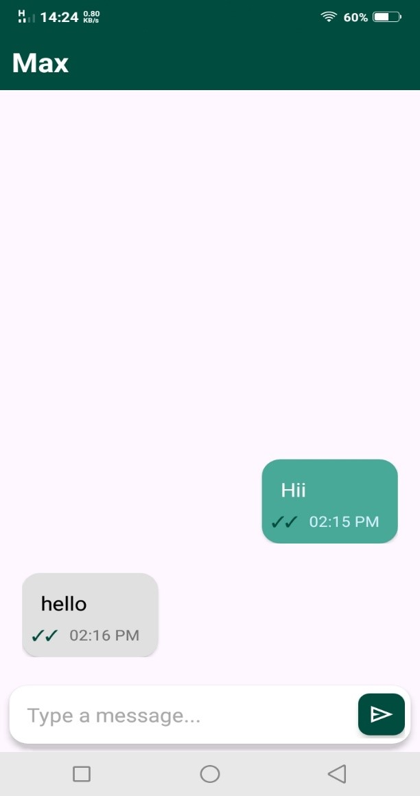
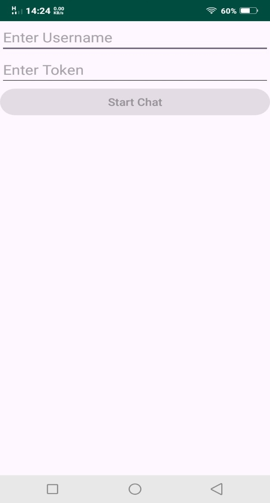
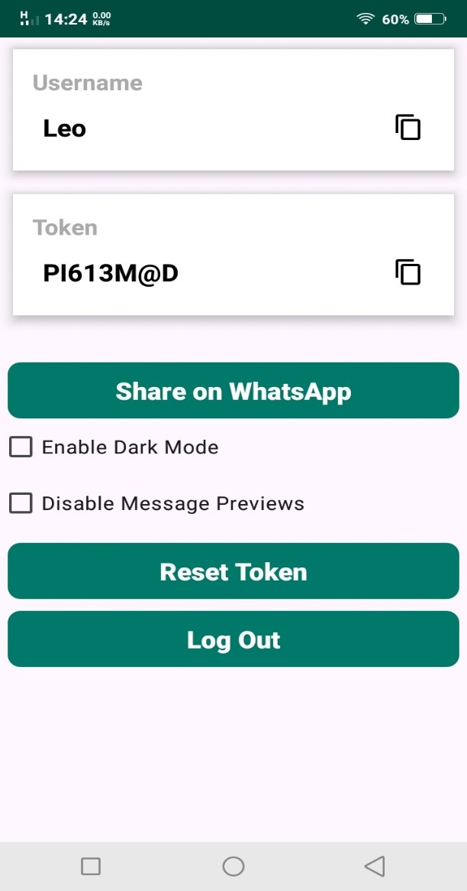

# 💬 Android Chatting App

A secure and private Android chat application that enables one-on-one communication **without traditional sign-up**. Users are assigned unique, system-generated usernames and tokens — eliminating the need for phone numbers or email addresses.

The app features:
- Real-time messaging with **sent**, **delivered**, and **seen** indicators.
- End-to-end security powered by **Firebase Firestore**.
- A lightweight, anonymous, and privacy-focused experience.

---

## 📱 Screenshots

<div align="center">
  <table>
    <tr>
      <td align="center">
        <strong>🏠 Home Screen</strong><br>
        
      </td>
      <td align="center">
        <strong>💬 Chat Screen</strong><br>
        
      </td>
    </tr>
    <tr>
      <td align="center">
        <strong>➕ Add User Screen</strong><br>
        
      </td>
      <td align="center">
        <strong>⚙️ Settings Screen</strong><br>
        
      </td>
    </tr>
  </table>
</div>

---

## ✨ Features

- 👤 Anonymous user assignment (no sign-up required)
- 🔑 System-generated user tokens for secure sessions
- 💬 Real-time 1-on-1 chat using Firebase Firestore
- ✅ Message indicators: Sent, Delivered, Seen
- 🟢 Online presence tracking
- 🔐 End-to-end encrypted communication
- 📱 Clean, lightweight, and privacy-first design

---

## 🛠️ Tech Stack

- 💻 Android Studio
- ☕ Java
- 🔥 Firebase (Authentication, Firestore, Storage)

---

## 🚀 Getting Started

To run the app locally:

1. Clone the repository:
   ```bash
   git clone https://github.com/ayaanbyte/Android-Chatting-App.git
